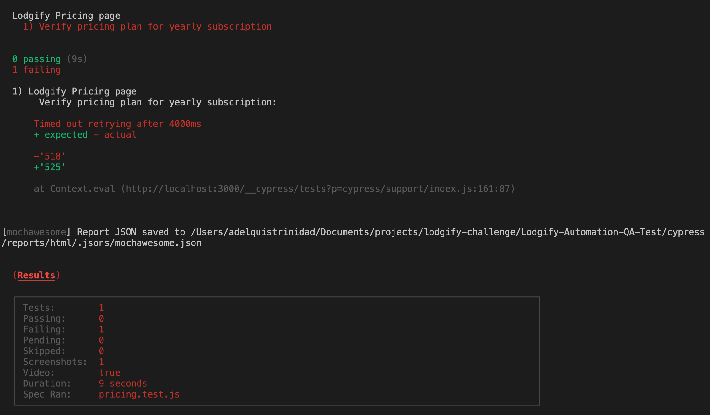

# Bug Report
## Bug list
#### Description:
The price displayed in Ultimate plan when selecting 50 rental is not correct
#### Devices: 
Chrome - version Version 99.0.4844.74 (Official Build) (x86_64)

#### Environment: 
localhost

#### Steps To Reproduce manually:

1. Go to url "localhost:3000/pricing.html"
2. Go to input element "scroll-prop-plan" (next to "number or rental bar"), and click it
3. Enter "50"
4. Go to "Ultimate" price section
5. Inspect the value displayed for "final price" (Price after discount)


#### Actual: 
The value displayed is "$518" (See attach below)
.png)

#### Expected: 
The value to display should be  "$525" 

#### Steps To Reproduce with Cypress:
1. In the code, go to "cypress/integration/pricing.test.js"
2. Search test case "Verify pricing plan for yearly subscription"
3. Add ".only" after it method as following
```js
  it.only('Verify pricing plan for yearly subscription', () => {
    //On "Lodgify Pricing" page, add a test to verify that the "Yearly" plan selecting 50 rentals displays: 
    //$64 for Starter plan $375 for Professional plan $525 for Ultimate plan

    cy.get("#scroll-prop-plan").clear().type(50)
    // Validate Starter price plan
    cy.getPricingValue('2', '64')
    // Validate Professional price plan
    cy.getPricingValue('1', '375')
    // Validate Ultimate price plan
    // TODO This test reports a bug. Expected result 518
    cy.getPricingValue('3', '525')

  });
```
4. Open a terminal into the project and execute:
```sh
npx cypress run --spec cypress/integration/pricing.test.js”
```


See video generated for more details